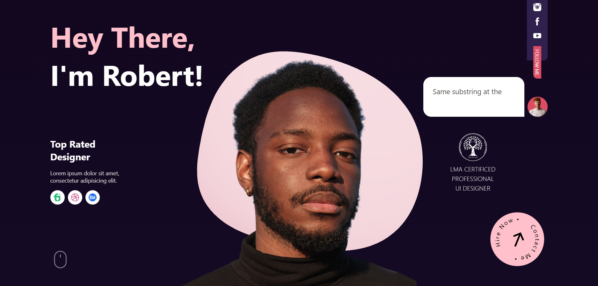
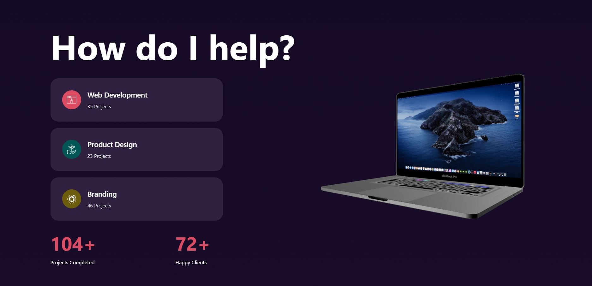
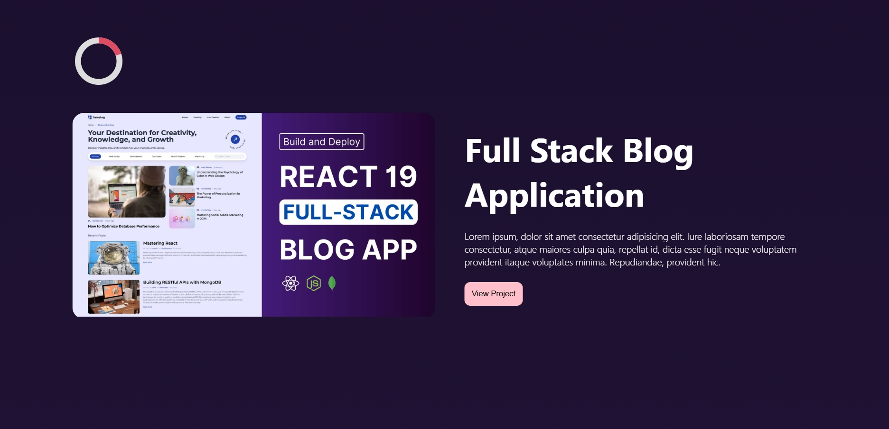
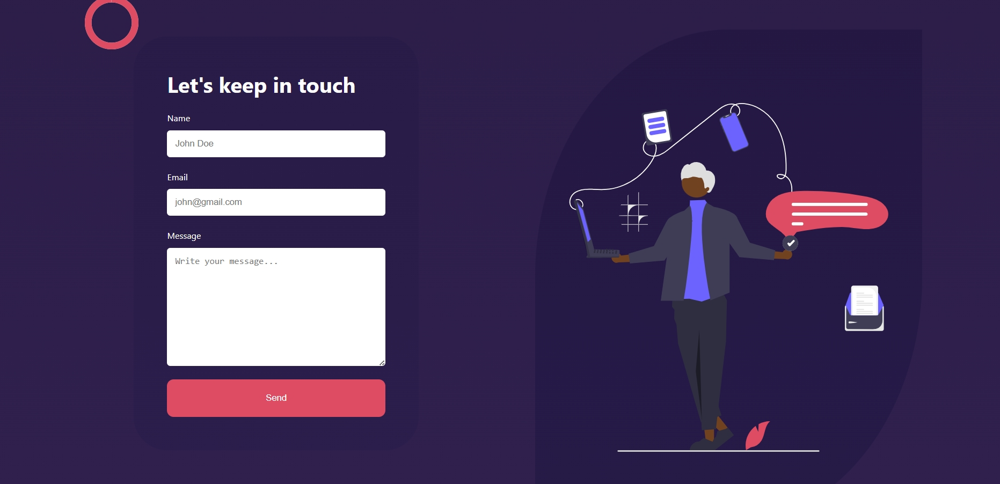

# React Portfolio 08

This design is inspired by the work of [Lama Dev](https://www.youtube.com/@LamaDev). Click [here](https://www.youtube.com/watch?v=KGCMSaEWPVs) to watch the video.

## Technologies

This web page was made with the following technologies:

- HTML5
- CSS3
- JavaScript
- React
- Vite
- React Three Fiber
- React Three Drei
- Three.js
- Motion (Framer Motion)
- React Type Animation
- React Lazyload

## Pages

This project contains 4 main sections: **Hero**, **Services**, **Portfolio** and **Contact**.

### Hero

#### In this section you will see an animated title with a typing effect, a short description, and interactive 3D elements. The background features a dynamic shape that adds depth to the design.



### Services

#### In this section you will see a title and a list of services offered. Each service card is clickable and displays a corresponding 3D model (Computer, Mug, or Console) on the right side. The section also includes counters showing completed projects and happy clients.



### Portfolio

#### In this section you will see multiple completed projects displayed in a scrollable layout. Each project card shows an image, title, and description. The cards have smooth animations and parallax effects when scrolling.



### Contact

#### In this section you will see a contact form where visitors can send messages directly. The form is powered by EmailJS and includes fields for name, email, and message. A 3D text animation is displayed on the right side.



## Features

- **Lazy Loading**: Optimized performance with React Lazyload and Suspense for faster initial page load.
- **3D Models**: Interactive 3D models using Three.js and React Three Fiber.
- **Smooth Animations**: Powered by Motion (Framer Motion) for fluid transitions.
- **Type Animation**: Dynamic typing effect in the hero section.

## Installation

Follow these steps to run the project locally:

### Prerequisites

Make sure you have [Node.js](https://nodejs.org/) installed on your machine.

### Steps

1. Clone the repository:
   
   ```
   git clone https://github.com/erickdc7/react-portfolio-8.git
   ```
    
3. Navigate to the project directory:

   ```
   cd react-portfolio-8
   ```
5. Install dependencies:

   ```
   npm install
   ```
7. Start the development server:

   ```
   npm run dev
   ```
